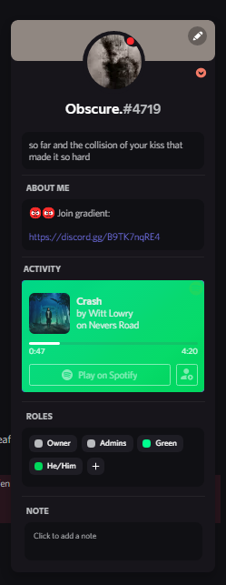
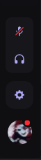
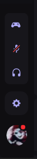

# Lavender

A good looking dark purple-ish theme for discord.

## Support

For bug reports open a issue here on github with the provided templates.

For problems installing or using the theme join our [server](discord.gg/B9TK7nqRE4) and ask for help.

# Important

When scrolling through member lists and long channel lists, the scrollbar randomly gets stuck and starts flickering. To get rid of this annoyance you can try the below fixes:

## Fix 1

Fix 1 is by downloading a plugin called [SmoothScrollPowercord](https://github.com/LynithDev/SmoothScrollPowerCord).

## Fix 2

Fix 2 is by unloading a part of the theme, this will make the channel list and members list a little ugly so only use this if Fix 1 doesn't work for you.

### For powercord

- **Step 1:** Go to `src` folder and open the `source.scss` file.

- **Step 2:** Inside `source.scss` file remove/comment out every line that starts with: `@use "lists/`

You might need to repeat this thing sometimes when you update the theme.

# Credits

Lavender uses snippets from many other theme devs, all the snippets are either in `/addons` folder or in snippets file in `src/base/snippets.css` with credits to the respective devs. (Contact me in my [server](discord.gg/B9TK7nqRE4) if I have forgotten or mistaken with any credits 👍)

## Concept

Lavender was inspired by a dashboard concept from dribble, made by [SajjadMohammadiNia](https://dribbble.com/SajjadMohammadiNia) for [Piqo Design](https://dribbble.com/Piqodesign).

### The original concept looked like: 

# Client Support

Lavender officially only supports powercord but if you want to use Lavender in other client mods you can do it yourself either by modifying `theme.css` file according to your client or importing the whole theme using `@import "https://obscure-git.github.io/Lavender/theme.css";`.

# Previews

Note: Screenshots might be outdated because I only update them like once a week and sometimes I forget 😬.

### Theme

### User Popouts

### User action buttons

### User action buttons with game activity toggle
