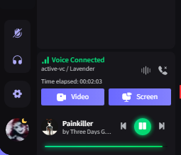
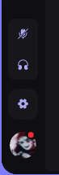
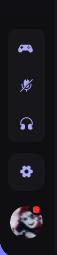
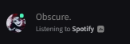
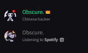
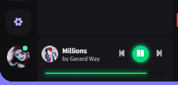

# Lavender

A good looking dark purple-ish theme for [discord](https://discord.com/).

## [Support](discord.gg/B9TK7nqRE4)

For bug reports open a issue here on github with the provided templates.

For problems installing or using the theme join our [server](discord.gg/B9TK7nqRE4) and ask for help.

# Installation

### • [Powercord](https://powercord.dev/)

- **Step 1:** Open **Command Prompt / Terminal / Powershell**
- **Step 2:** Paste the below code in your terminal:

```bash
cd powercord/src/Powercord/themes && git clone https://github.com/Obscure-Git/Lavender
cd %homepath%
```

### • [BetterDiscord](https://betterdiscord.app/)

- **Step 1:** Go to [releases](https://github.com/Obscure-Git/Lavender/releases) tab of this repo.
- **Step 2:** Click on the `lavender.theme.css` file to download it.
- **Step 3:** Paste the downloaded file inside your **BetterDiscord**'s themes folder.

### • [GooseMod](https://goosemod.com/)

- **Step 1:** Go to the themes store in **GooseMod** and search for "**Lavender**".
- **Step 2:** Press the install button.

### • [Vizality](https://vizality.com/)

- **Step 1:** Open your themes folder.

- **Step 2:** Open a **Command Prompt / Terminal / Powershell** window there and paste the below code:

  ```bash
  git clone https://github.com/Obscure-Git/Lavender
  ```

### • [Browser / Web](https://github.com/Obscure-Git/Lavender#browser--web)

- **Method 1:**

  ​	**Step 1:** Install [**GooseMod**](https://goosemod.com)'s browser extension for [Chrome](https://chrome.google.com/webstore/detail/goosemod-for-web/clgkdcccmbjmjdbdgcigpocfkkjeaeld) / [Firefox](https://addons.mozilla.org/en-US/firefox/addon/goosemod-for-web/).

  ​	**Step 2:** Go to the themes store and search for "**Lavender**".

  ​	**Step 3:** Press the install button.

  

- **Method 2:**

  ​	**Step 1:** Install the [**Stylus**](https://add0n.com/stylus.html) extension for [Chrome](https://chrome.google.com/webstore/detail/stylus/clngdbkpkpeebahjckkjfobafhncgmne) / [Firefox](https://addons.mozilla.org/en-US/firefox/addon/styl-us/) / [Opera](https://github.com/openstyles/stylus/wiki/Opera,-Outdated-Stylus).

  ​	**Step 2:** After installing, head over to [this link](https://obscure-git.github.io/Lavender/clients/lavender.user.css).

  ​	**Step 3:** Press the "**Install Style**" button.

# Important

When scrolling through member lists and long channel lists, the scrollbar randomly gets stuck and starts flickering. To get rid of this annoyance you need to install Smooth Scroll plugin for [Powercord](https://github.com/LynithDev/SmoothScrollPowerCord) / [BetterDiscord](https://github.com/Obscure-Git/Lavender/releases/download/v1.1.0/smoothscrollBD.plugin.js).

**Note: ** The plugin is owned and maintained by **[LynithDev](https://github.com/LynithDev)** for Powercord so all the credits to him. The BetterDiscord version of this plugin is just a rough port that I made of Lynith's plugin and it is directly importing the SmoothScroll file from Lynith's repo.

# Credits

Lavender uses snippets from many other theme devs, all the snippets are either in [`/addons`](https://github.com/Obscure-Git/Lavender/tree/main/addons) folder or in snippets file in [`/src/base/snippets.css`](https://github.com/Obscure-Git/Lavender/blob/main/src/base/snippets.css) with credits to the respective devs. (Contact me in my [server](discord.gg/B9TK7nqRE4) if I have forgotten or mistaken with any credits 👍)

## [Concept](https://dribbble.com/shots/15137908-Social-Media-Management-Dashboard)

Lavender was inspired by a dashboard concept from dribble, made by [SajjadMohammadiNia](https://dribbble.com/SajjadMohammadiNia) for [Piqo Design](https://dribbble.com/Piqodesign).

### The original concept looked like: 


# [Previews](https://github.com/Obscure-Git/Lavender/tree/main/assets)

Note: Screenshots might be outdated because I only update them like once a week and sometimes I forget 😬.

### • [Theme](https://obscure-git.github.io/Lavender/assets/1.png)


### • [User Popouts](https://obscure-git.github.io/Lavender/assets/2.png)


### • [User action buttons](https://obscure-git.github.io/Lavender/assets/3.png)



### • [Status Indicators](https://obscure-git.github.io/Lavender/assets/4a.png)




### • [Powercord Spotify Module](https://obscure-git.github.io/Lavender/assets/5.gif)

