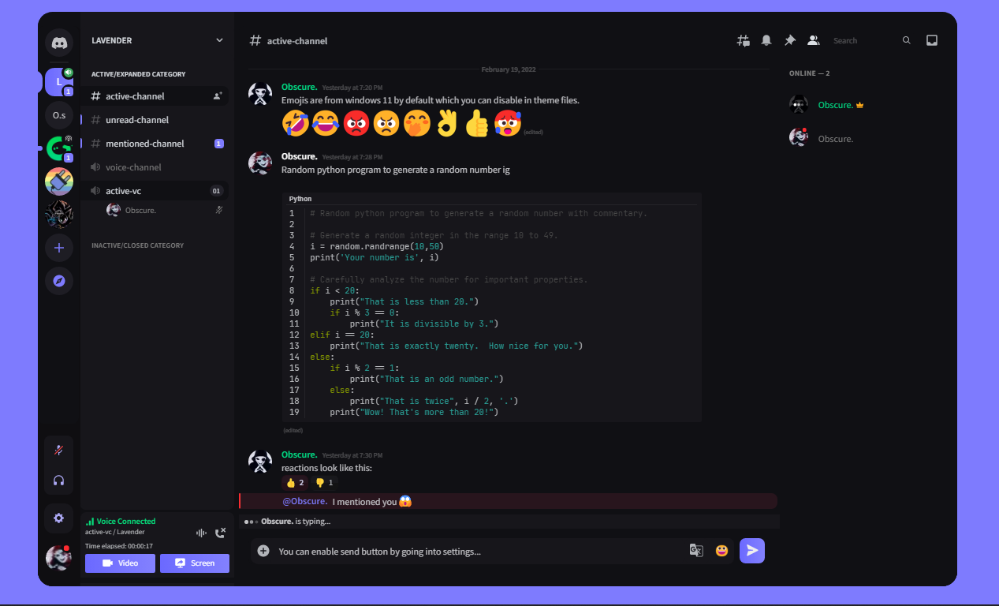

# Lavender

A good looking dark purple-ish theme for powercord.

If you got any suggestions for / issues with this theme just ping @Obscure.#4719 in #theme-dev of powercord server or open an issue here with the given templates.

# Important

When scrolling through member lists and long channel lists, the scrollbar randomly gets stuck and starts flickering. To get rid of this annoyance you can try the below fixes:

## Fix 1

Fix 1 is by downloading a plugin called [SmoothScrollPowercord](https://github.com/LynithDev/SmoothScrollPowerCord).

## Fix 2

Fix 2 is by unloading a part of the theme, this will make the channel list and members list a little ugly so only use this if Fix 1 doesn't work for you.

### For powercord

- **Step 1:** Go to `src` folder and open the `source.scss` file.

- **Step 2:** Inside `source.scss` file remove this line: `@use "components/membersList";` 

  You will need to repeat this thing everytime you update Lavender theme.

# Credits

This theme uses some snippets from [@CorellanStoma#1996](https://github.com/CorellanStoma), [@LuckFire#4800](https://github.com/LuckFire) and [@mr_miner#9699](https://github.com/mr-miner1) so credits to them. 👍

# Screenshots

The below screenshot is currently outdated, I'll update it soon with screenshots that better represent the theme

# Clients

Lavender is now only for Powercord. Removed from better discord recently due to some reasons.

# Server

Lavender doesn't have a server of its own obviously but I do have a random community server called Gradient, you can join it for some fun maybe 🤷‍.

• Invite link: [dicord.gg/B9TK7nqRE4](https://discord.gg/B9TK7nqRE4)
